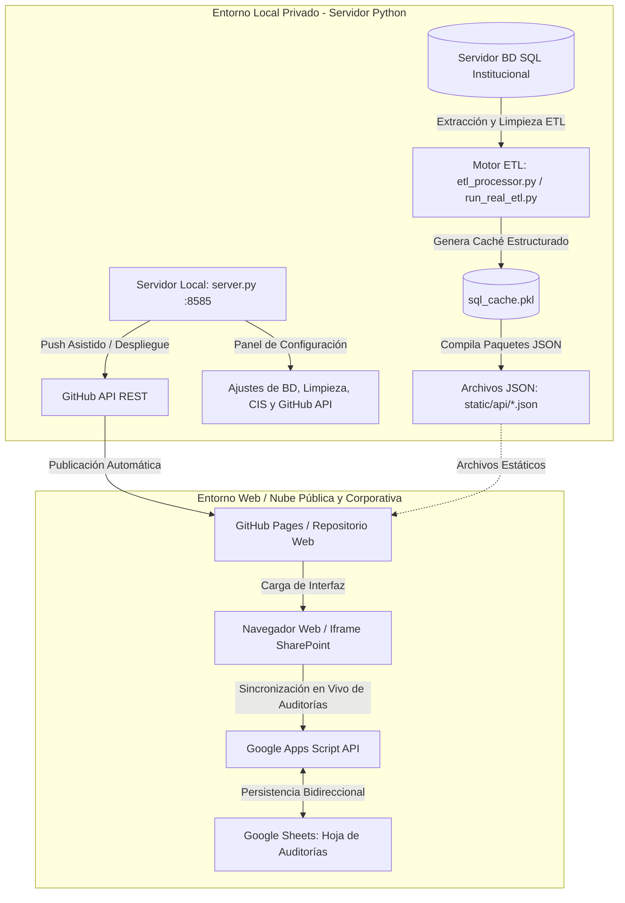
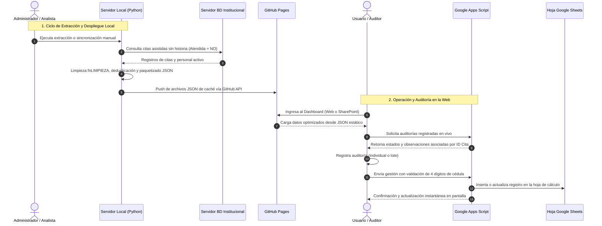

# Sistema Web de Seguimiento a Cierre de Historias Clínicas - AGENDAWEB

Aplicación web interactiva de alto rendimiento desarrollada para la gestión, auditoría y control del cierre de historias clínicas en **Unión para la Salud y la Vida S.A.S.** Esta plataforma reemplaza y amplía las capacidades del informe analítico institucional, proporcionando herramientas operativas de auditoría individual y masiva, filtros dinámicos en cascada, sincronización en tiempo real y una arquitectura desacoplada para despliegue local y en la nube.

---

## 🌟 1. Políticas Institucionales y Reglas de Negocio

El sistema opera bajo lineamientos claros orientados a la oportunidad y calidad en el registro de la atención en salud:

1. **Enfoque Exclusivo en Citas Sin Reporte de Atención**:
   - La base de datos y la interfaz se concentran **única y exclusivamente en citas confirmadas/asistidas que no cuentan con evidencia de historia clínica diligenciada** (`Atendida = NO`).
2. **Exclusión de Códigos de Servicio Especiales**:
   - Se excluyen automáticamente del cómputo y de las tablas aquellos servicios asistenciales o administrativos parametrizados que no requieren el diligenciamiento de una historia clínica estándar bajo esta modalidad.
3. **Normalización de Nombres de Sedes y Programas**:
   - El motor de procesamiento aplica reglas de limpieza ortográfica y homologación de caracteres (`text_cleaning_rules`) para corregir inconsistencias y mapear sedes y Centros Integrales de Salud (CIS) de manera uniforme.
4. **Validación de Identidad y Personal Activo**:
   - El sistema mantiene un directorio en memoria del personal asistencial y auditores activos. Al asentar una auditoría, se exige la **verificación estricta de los 4 últimos dígitos de la cédula del usuario**, previniendo suplantaciones y errores de registro.
5. **Reestructuración de Métricas de Avance de Auditoría**:
   - Se cuantifica el avance de gestión por sede y profesional mediante estados tipificados:
     - **Notas de Resolución / Cierre**: Citas marcadas como gestionadas (*Historia ya cerrada en sistema*, *Novedad médica*, *Inasistencia Justificada*, *Paciente reagendado*, etc.) que se retiran del conteo de pendientes activos.
     - **Notas en Curso**: Estados como *Historia en progreso*, *Paciente confirmado sin evidencia de historia ni notas aclaratorias* o *Historia pendiente por caída del sistema* se contabilizan en la columna **Confirmada pendiente** para seguimiento activo.

---

## 🏛️ 2. Arquitectura del Sistema: Separación Local vs. Web

La plataforma está diseñada bajo un modelo híbrido que separa estrictamente las tareas administrativas y de extracción pesada (entorno local) del acceso operativo y de consulta para los auditores (entorno web).



### Comparativa de Capacidades por Entorno

| Característica / Función | Servidor Local (`localhost:8585`) | Entorno Web (`GitHub Pages` / `SharePoint`) |
| :--- | :---: | :---: |
| **Conexión Directa a SQL Server** | ✅ Sí (Credenciales protegidas en servidor local) | ❌ No (Zero-backend, máxima seguridad) |
| **Extracción y Procesamiento ETL** | ✅ Sí (Manual o programado) | ❌ No (Consume datos precalculados) |
| **Panel de Configuración (`btnConfig`)** | ✅ Visible (Gestión de conexión, reglas y tokens) | 🔒 Oculto automáticamente por seguridad |
| **Sincronización Manual SQL (`btnManualSync`)** | ✅ Visible (Comprueba firmas de BD) | 🔒 Oculto automáticamente por seguridad |
| **Sincronización de Auditorías en Vivo** | ✅ Sí (Vía API local y Google Sheets) | ✅ Sí (Directo a Google Apps Script) |
| **Auditoría Individual y en Lotes (Masiva)** | ✅ Sí | ✅ Sí |
| **Exportación a Excel** | ✅ Servidor Python (openpyxl nativo) | ✅ Cliente navegador (SheetJS / CSV UTF-8) |
| **Copiado Rápido de Cédula en Iframe** | ✅ Sí | ✅ Sí (Optimizado para SharePoint) |
| **Publicación / Despliegue a GitHub** | ✅ Sí (Push de código y caché con PAT) | ❌ No aplicable |

---

## 🚀 3. Funcionalidades Principales de la Interfaz

### 1. Filtros Dinámicos en Cascada Multiselección
- **Selector de Período**: Permite alternar entre *Último mes*, *Fechas previas* o *Ambos períodos*.
- **Filtros Temporales y Organizacionales**: Menús desplegables de selección múltiple con buscador integrado por *Año*, *Mes*, *Día*, *Quincena*, *Sede (IPS)*, *Programa asistencial* y *Profesional*.
- **Cascada Bidireccional Predictiva**: Al seleccionar uno o varios valores en cualquier filtro, las opciones de los demás filtros se recalculan instantáneamente, mostrando solo los elementos que contienen citas pendientes en esa combinación.
- **Árbol Cronológico de Fechas**: Panel lateral colapsable que desglosa los pendientes por mes y día en tiempo real.

### 2. Tablas Interactivas con Ordenamiento Multiestado
Todas las tablas cuentan con un sistema de ordenamiento de 3 estados al hacer clic en cualquier cabecera:
1. **Primer clic**: Orden ascendente ($A \to Z$ o menor a mayor).
2. **Segundo clic**: Orden descendente ($Z \to A$ o mayor a menor).
3. **Tercer clic**: Retorno al orden predeterminado de la vista.

- **Tabla 1: Resumen de Citas AGENDAWEB por Sedes**:
  - Columnas: `Sede`, `Pendientes Totales`, `Gestionadas / Aclaradas`, `Confirmada pendiente`, `Sin Auditar` y `% Avance`.
  - Muestra fila de totales consolidados al pie de la tabla.
- **Tabla 2: Citas sin Reporte de Atención por Profesional**:
  - Presenta a todos los profesionales con pendientes, su número de documento, sede y total de historias por cerrar.
- **Tabla 3: Detalle Operativo de Citas Pendientes**:
  - Paginación dinámica (50 registros por página), buscador global predictivo en tiempo real y etiqueta de estado visual.
  - **Copiado de Cédula a 1 Clic**: Integración con compatibilidad avanzada para portales corporativos e iframes restringidos (como Microsoft SharePoint).
  - Botones dinámicos de acción: **`Auditar`** (para citas sin gestión previa) y **`Editar`** (para actualizar notas ya registradas).

### 3. Auditoría Individual y Masiva (Gestión en Lote)
- **Modo Individual**: Permite abrir el formulario de auditoría para una cita específica.
- **Modo Masivo**: Casillas de verificación por fila y casilla maestra *"Seleccionar Todo"*. Permite aplicar el mismo estado, auditor y observación a decenas de historias clínicas en una sola operación.
- **Validación de Identidad**: Autocompletado del nombre del auditor y validación obligatoria contra los 4 últimos dígitos de su cédula registrada.

### 4. Gráficos Estadísticos Dinámicos
- **Top 10 Sedes**: Comparativa en valores absolutos de las sedes con mayor volumen de citas pendientes.
- **Pendientes por Programa**: Distribución porcentual y cuantitativa según la tipología de consulta médica.
- **Pendientes por Mes**: Tendencia histórica mensual de citas pendientes de atención.

---

## 🔄 4. Flujo de Datos y Sincronización



### Campos Registrados en la Bitácora de Auditoría (Google Sheets)
Cada gestión asentada desde la interfaz registra 9 campos trazables:
1. `ID Cita`: Identificador único de la cita en la base de datos de agenda.
2. `Estado Gestión`: Tipificación seleccionada de la auditoría.
3. `Observaciones Auditor`: Justificación o detalle de la gestión realizada.
4. `Auditor / Usuario`: Nombre completo del profesional que auditó.
5. `Cédula Auditor`: Últimos 4 dígitos validados del auditor.
6. `Fecha Gestión`: Estampa de tiempo del momento del registro.
7. `IP Equipo`: Dirección IP origen de la solicitud.
8. `Usuario PC`: Identificador del sistema operativo (en auditorías locales).
9. `Nombre Máquina PC`: Nombre del host de trabajo (en auditorías locales).

---

## 📁 5. Estructura del Repositorio

```text
├── index.html                      # Página principal del dashboard para GitHub Pages y servidor local
├── .nojekyll                       # Indicador para GitHub Pages que permite servir carpetas y archivos JSON
├── config.json                     # Parámetros públicos: URLs de Google Apps Script, reglas de limpieza y CIS
├── db_config.example.json          # Plantilla de ejemplo para conexión local (sin datos sensibles)
├── db_signature.json               # Huella digital y firma de última actualización de la base de datos
├── etl_processor.py                # Motor ETL de transformación, limpieza, deduplicación y cálculo de resúmenes
├── run_real_etl.py                 # Script de ejecución directa del proceso ETL desde consola
├── server.py                       # Servidor backend Python HTTP/REST (puerto 8585) con panel de gestión
├── google_sheets.py                # Conector bidireccional entre Python, Google Sheets y GitHub API
├── google_apps_script_template.js  # Código fuente para desplegar en Google Apps Script
├── static/
│   ├── app.js                     # Lógica cliente: filtros en cascada, auditoría, ordenamiento y gráficos
│   ├── styles.css                 # Hoja de estilos institucionales, temas de tablas y diseño responsivo
│   └── api/                       # Archivos JSON precalculados de contingencia para GitHub Pages
│       ├── dashboard_ultimo_mes.json
│       ├── dashboard_fechas_previas.json
│       ├── dashboard_ambos.json
│       └── dashboard.json
```

---

## 💻 6. Guía de Puesta en Marcha

### A. Ejecución del Servidor Local (Entorno de Administración)

1. **Requisitos Previos**:
   - Python 3.10 o superior instalado.
   - Driver ODBC para SQL Server instalado en el equipo.
   - Dependencias de Python requeridas:
     ```bash
     pip install pandas numpy pyodbc openpyxl requests
     ```
2. **Configuración de Acceso Local**:
   - Crear el archivo privado `db_config.json` en la raíz del proyecto tomando como referencia `db_config.example.json`:
     ```json
     {
       "database": {
         "server": "NOMBRE_O_HOST_DEL_SERVIDOR",
         "port": "1433",
         "user": "USUARIO_BD",
         "password": "PASSWORD_BD",
         "databases": {
           "agendaweb": "NOMBRE_BD_AGENDA",
           "svces": "NOMBRE_BD_SERVICIOS"
         },
         "driver": "{ODBC Driver 17 for SQL Server}"
       },
       "github": {
         "repo": "organizacion/repositorio",
         "branch": "main",
         "token": "PERSONAL_ACCESS_TOKEN_GH"
       }
     }
     ```
     *(Nota: `db_config.json` se encuentra protegido e ignorado en `.gitignore` para no subirse a repositorios públicos).*

3. **Iniciar el Servidor**:
   ```bash
   py -u server.py
   ```
4. **Abrir en el Navegador**:
   - Acceder a **`http://localhost:8585`**.
   - En este entorno estarán activos los botones superiores de **"Verificar BD"** (sincronización manual) y **"Configuración"** (panel de administración).

5. **Ejecución Directa del Motor ETL (Opcional por Consola)**:
   ```bash
   python run_real_etl.py
   ```

---

### B. Despliegue en GitHub Pages (Entorno Web Público / Auditores)

1. Suba los archivos del proyecto a su repositorio en **GitHub**.
2. En GitHub, ingrese a la pestaña **Settings** del repositorio.
3. En el menú lateral izquierdo, seleccione **Pages**.
4. En **Build and deployment**:
   - **Source**: `Deploy from a branch`
   - **Branch**: Seleccione `main` y la carpeta **`/(root)`**.
   - Haga clic en **Save**.
5. En 1-2 minutos GitHub Pages publicará el sitio bajo la URL:
   ```text
   https://<usuario-o-organizacion>.github.io/<nombre-repositorio>/
   ```
6. **Sincronización Quincenal de Caché desde el Panel Local**:
   - Desde el servidor local (`http://localhost:8585`), abra el panel de **Configuración** y diríjase a la pestaña **GitHub**.
   - Seleccione la opción de subir los archivos JSON de caché estático para mantener los datos de GitHub Pages actualizados con un solo clic.

---

### C. Configuración de Google Apps Script (Persistencia en la Nube)

1. En su Google Drive corporativo, cree una Hoja de Cálculo de Google.
2. Dentro de la hoja, abra el menú **Extensiones ➔ Apps Script**.
3. Reemplace el contenido del editor con el código de [`google_apps_script_template.js`](file:///g:/Mi%20unidad/Programas/Desarrollos/Seguimiento%20Agendaweb/Cierre%20de%20historias/google_apps_script_template.js).
4. Seleccione la función `setupPermissions` en la barra superior y haga clic en **Ejecutar** para conceder los permisos de acceso a Drive y Sheets.
5. Haga clic en **Implementar ➔ Nueva implementación**:
   - **Tipo**: *Aplicación web*.
   - **Ejecutar como**: *Yo* (*Mi cuenta*).
   - **Quién tiene acceso**: *Cualquier persona* (*Anyone*).
6. Copie la **URL de la aplicación web** generada y verifique que esté configurada en `config.json` bajo la clave `google_sheets_apps_script_url`.

---

## 🛡️ 7. Seguridad y Buenas Prácticas

- **Cero Datos Sensibles en Clientes Web**: La aplicación desplegada en GitHub Pages o embebida en SharePoint solo consume datos precompilados en JSON y se comunica con la API de Google Apps Script. Ningún parámetro de infraestructura interna queda expuesto en el código cliente.
- **Protección de Credenciales Locales**: El archivo `db_config.json`, firmas de base de datos (`db_signature.json`) y cachés binarios (`.pkl`) se encuentran estrictamente excluidos del control de versiones mediante `.gitignore`.
- **Compatibilidad con Iframes Corporativos**: Diseñado para operar de forma transparente y segura dentro de portales institucionales de Microsoft 365 y SharePoint sin requerir privilegios elevados de explorador.
