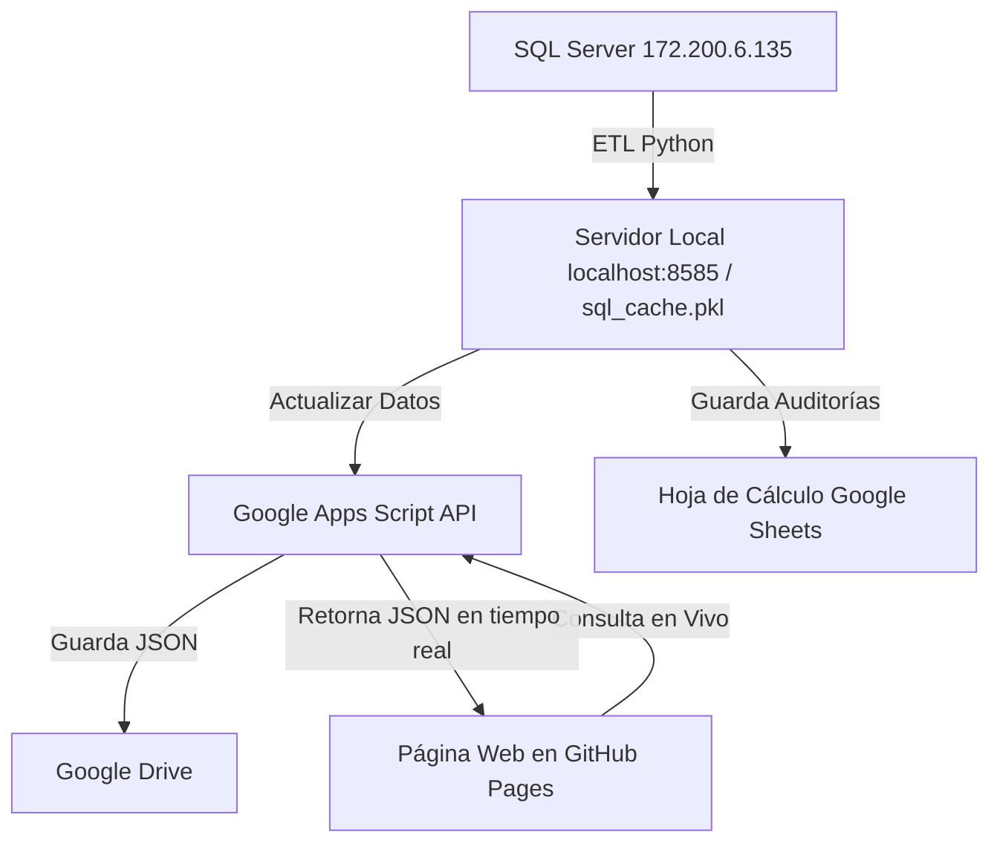

# Sistema Web de Seguimiento a Cierre de Historias Clínicas - AGENDAWEB

Aplicación web interactiva de alto rendimiento desarrollada para reemplazar y extender el informe de PowerBI **"SEGUIMIENTO A CIERRE DE HISTORIAS CLINICAS - AGENDAWEB"** de *Unión para la Salud y la Vida S.A.S*.

---

## 🌟 1. Políticas y Estructuración del Sistema

1. **Enfoque Exclusivo en Citas Sin Reporte de Atención**:
   - La base de datos y la interfaz se enfocan **única y exclusivamente en citas asistidas/confirmadas que NO cuentan con evidencia de historia clínica** (Atendidas = NO).
2. **Conservación de Personal Activo**:
   - Se mantiene la sincronización en caché del personal activo para permitir la búsqueda predictiva de auditores/profesionales por nombre y cédula.
3. **Reestructuración de Métricas de Auditoría**:
   - En lugar de inasistencias o totales históricos, el sistema mide el avance de las gestiones de auditoría mediante notas aclaratorias.
4. **Respeto a la Distribución y Estilo Visual**:
   - Se mantiene la distribución de paneles, tablas, tipografías y paleta de colores institucional.

---

## 🚀 2. Características Principales

### 📊 **Visualización e Indicadores (Dashboard)**
- **Filtros Relacionados en Cascada**:
  - Filtros dinámicos por *Período* (*Último mes* / *Fechas previas* / *Ambos*), *Año*, *Mes*, *Día*, *Quincena*, *Sede*, *Programa* y *Profesional*.
  - **Cascada Bidireccional**: Al seleccionar una opción en cualquier filtro (ej. *Sede: Manrique*), las listas desplegables de los demás filtros se adaptan automáticamente mostrando solo las opciones que poseen citas pendientes en ese subconjunto.
- **Tabla 1: Resumen de Datos AGENDAWEB por Sedes**:
  - Columnas: `Sede`, `Pendientes Totales`, `Gestionadas / Aclaradas`, `Confirmada pendiente`, `Sin Auditar` y `% Avance`.
  - La columna **Confirmada pendiente** agrupa y contabiliza de forma combinada las notas: *Historia en progreso*, *Paciente confirmado sin evidencia de historia ni notas aclaratorias* e *Historia pendiente por caída del sistema*.
- **Tabla 2: Citas Confirmadas sin Reporte de Atención por Médico**:
  - Muestra a **TODOS** los profesionales que registran historias pendientes sin límites de corte ni restricciones.
- **Tabla 3: Detalle de Citas Confirmadas**:
  - Incluye paginación completa (*Página X de Y*), buscador global predictivo, copiado en 1 clic de documento del paciente, etiqueta de estado (*Sin Auditar* por defecto), y columna de **Acción** con botones dinámicos **`Auditar`** (para registros nuevos) y **`Editar`** (para registros previamente auditados).
- **Gráficos Dinámicos**:
  - *Sedes con mayor número de citas confirmadas sin reporte de atención* (en valores absolutos).
  - *Pendientes de atención por programas*.
  - *Pendientes atención por mes*.

---

## ⚡ 3. Arquitectura de Datos y Sincronización Automática



### 1. **Motor ETL y Caché Local (`etl_processor.py`)**:
- Extrae la información desde SQL Server `172.200.6.135` (`BDSVCES`).
- Aplica reglas de normalización `fnLIMPIEZA` y deduplicación por `ID_CITA`.
- Guarda el caché local de alta velocidad en `sql_cache.pkl` (25,280+ pendientes).

### 2. **Sincronización Automática a la Nube (Google Drive + Apps Script)**:
- **Cero Re-despliegues Continuos**: La web se sube a GitHub Pages una sola vez.
- Al dar clic en **"Actualizar datos de cierre"** en el servidor local, Python sincroniza en segundo plano el nuevo caché en tiempo real con Google Drive a través de Google Apps Script (`save_dashboard_cache`).
- La web en GitHub Pages consulta en vivo desde Google Apps Script (`Google Drive (Sincronizado en Vivo)`), mostrando la información actualizada para todos los usuarios sin necesidad de volver a subir archivos al repositorio.

### 3. **Persistencia de Notas de Auditoría**:
- Las observaciones de los auditores se envían a la Hoja de Cálculo en Google Drive registrando 9 campos: `ID Cita`, `Estado Gestión`, `Observaciones Auditor`, `Auditor / Usuario`, `Cédula Auditor`, `Fecha Gestión`, `IP Equipo`, `Usuario PC` y `Nombre Máquina PC`.

---

## 🌐 4. Publicación en GitHub Pages (Paso a Paso)

1. Suba los archivos de su proyecto a su repositorio en **GitHub**.
2. En GitHub, ingrese a su repositorio y diríjase a **Settings** (pestaña superior derecha).
3. En el menú lateral izquierdo, seleccione **Pages**.
4. En la sección **Build and deployment**:
   - **Source**: Deploy from a branch
   - **Branch**: Seleccione `main` (o `master`) y elija la carpeta **`/ (root)`**.
   - Haga clic en **Save**.
5. En 1-2 minutos GitHub Pages publicará su sitio web bajo la URL:
   `https://<usuario>.github.io/<repositorio>/`

---

## 🛠️ 5. Estructura de Archivos del Proyecto

- `index.html`: Archivo principal de entrada para GitHub Pages en la raíz del repositorio.
- `.nojekyll`: Archivo que asegura que GitHub Pages sirva todos los recursos estáticos y JSON directamente.
- `server.py`: Servidor backend HTTP/REST API en Python ejecutándose en el puerto `8585`.
- `etl_processor.py`: Motor ETL de extracción, deduplicación y cálculo de resúmenes.
- `google_sheets.py`: Conector de persistencia y sincronización en segundo plano con Google Sheets y Google Drive.
- `google_apps_script_template.js`: Código del Web App para pegar en Google Apps Script.
- `static/styles.css`: Hoja de estilos institucionales y responsive design.
- `static/app.js`: Lógica cliente (Filtros en cascada, auditoría masiva, renderizado de tablas, gráficos Chart.js, paginación y consulta directa a Google Drive).

---

## 💻 6. Instrucciones de Ejecución Local

### **Servidor Local (Desarrollo y Auditoría)**
```bash
py -u server.py
```
Acceder en el navegador a: **`http://localhost:8585`**

---

## 🔒 7. Configuración de Permisos en Google Apps Script (Primera Vez)

1. En la Hoja de Cálculo de Google Drive, abrir **Extensiones ➔ Apps Script**.
2. Pegar el código de [`google_apps_script_template.js`](file:///g:/Mi%20unidad/Programas/Desarrollos/Cierre%20de%20historias/google_apps_script_template.js).
3. Seleccionar la función `setupPermissions` y hacer clic en **▶️ Ejecutar** para autorizar los permisos de `DriveApp`.
4. Ir a **Implementar ➔ Nueva implementación**:
   - Tipo: **Aplicación web**.
   - Quién tiene acceso: **Cualquier persona** (*Anyone*).
5. Copiar la URL generada y verificar que esté asignada en `config.json`.
